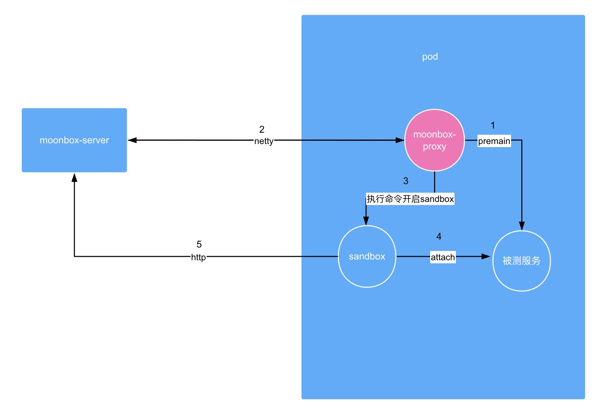
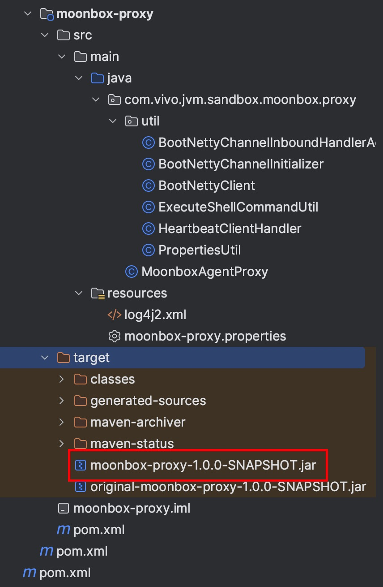
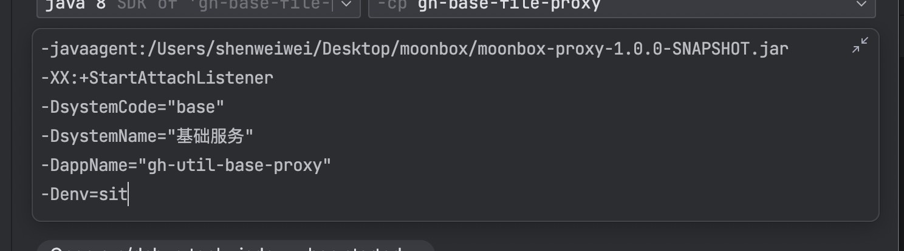
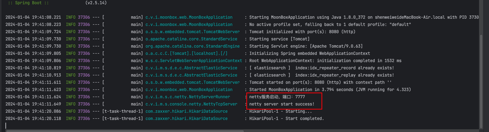
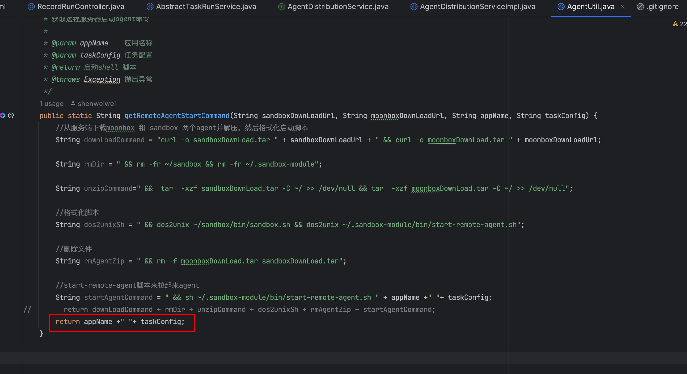
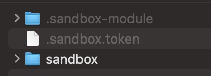
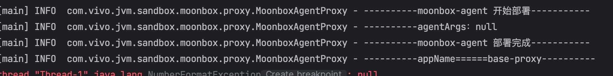
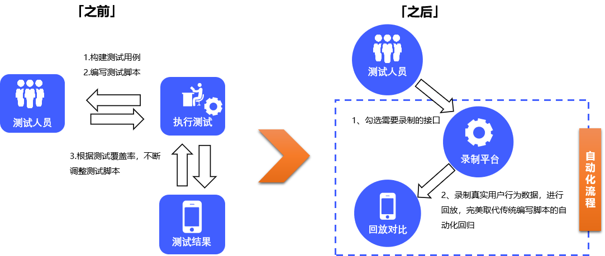

# moonbox接入k8s
## 前提
moonbox开发时k8s并不流行，所以使用ip+port的方式接入，但是k8s环境中，k8s的pod会经常变化，所以需要使用服务发现的方式接入。<br>
这里我开发一个moonbox-agent给被测应用使用，通过服务发现的方式接入moonbox。<br>
moonbox-agent需要以pre方式agent到被测应用，在pod中通过netty控制moonbox、sandbox的启停。<br>
## 架构图

## 步骤
### 1、数据库新增服务管理表
mysql5.6
```sql
create table sys_app
(
    id                  bigint                                 not null  AUTO INCREMENT COMMENT comment '自增主键'
        primary key,
    system_code         varchar(128)                            null comment '系统编码',
    system_name         varchar(128)                            null comment '系统名称',
    app_name            varchar(128)                            not null comment '项目名',
    channel_id          varchar(128)                            null comment 'netty管道id',
    last_heartbeat_time timestamp default CURRENT_TIMESTAMP     not null on update CURRENT_TIMESTAMP comment '最后上报时间',
    ip                  varchar(128)                            null comment '机器ip',
    remark              varchar(255)                            null comment '补充字段',
    creator             varchar(128)                            null comment '创建人',
    app_env             varchar(128)                            null comment '环境',
    create_time         timestamp default '0000-00-00 00:00:00' not null comment '创建时间',
    update_time         timestamp default '0000-00-00 00:00:00' comment '更新时间',
    online_state        int(2)                                  null comment '数据删除状态,1在线，0为离线',
    constraint idx_channel_id
        unique (channel_id)
);
```
mysql5.7
```sql
CREATE TABLE sys_app
(
    id                  bigint NOT NULL AUTO_INCREMENT COMMENT '自增主键',
    system_code         varchar(128) COMMENT '系统编码',
    system_name         varchar(128) COMMENT '系统名称',
    app_name            varchar(128) NOT NULL COMMENT '项目名',
    channel_id          varchar(128) COMMENT 'netty管道id',
    last_heartbeat_time timestamp NOT NULL DEFAULT CURRENT_TIMESTAMP ON UPDATE CURRENT_TIMESTAMP COMMENT '最后上报时间',
    ip                  varchar(128) COMMENT '机器ip',
    remark              varchar(255) COMMENT '补充字段',
    creator             varchar(128) COMMENT '创建人',
    app_env             varchar(128) COMMENT '环境',
    create_time         timestamp NOT NULL DEFAULT CURRENT_TIMESTAMP COMMENT '创建时间',
    update_time         timestamp DEFAULT CURRENT_TIMESTAMP COMMENT '更新时间',
    online_state        int(2) COMMENT '数据删除状态,1在线，0为离线',
    PRIMARY KEY (id),
    CONSTRAINT idx_channel_id UNIQUE (channel_id)
);
```
### 2、moonbox-server端开启一个netty服务
修改moonbox-web中application.properties
```properties
moonbox.netty.server.port=7777
```

### 3、打包moobox-proxy
在moonbox-agent/moonbox-proxy下修改moonbox-proxy.properties
```properties
#moonbox服务端ip
moonbox.netty.server.ip=10.56.34.68
#moonbox服务端netty端口
moonbox.netty.server.port=7777
```
在moonbox-agent/moonbox-proxy下执行mvn clean package -Dmaven.test.skip=true

将target下生成的jar包上传到服务器


### 4、修改被测应用启动脚本，添加参数
例如：<br>
java -XX:+StartAttachListener -javaagent:/moonbox/moonbox-proxy-1.0.0-SNAPSHOT.jar -jar  -DsystemCode="base" -DsystemName="基础服务" -DappName="gh-util-base-proxy" -Denv=sit demo.jar

参数说明：<br>
-javaagent参数表示启动字节码增强<br>
-XX:+StartAttachListener参数表示开启attach机制，在jvm启动时进行字节码增强<br>
-DsystemCode参数表示系统编码，在moonbox中用于区分不同的系统<br>
-DsystemName参数表示系统名称，在moonbox中用于区分不同的系统<br>
-DappName参数表示应用名称，在moonbox中用于区分不同的应用<br>
-Denv参数表示应用环境，在moonbox中用于区分不同的应用环境<br>

### 5、启动moonbox-server

### 6、启动被测应用
我不想在镜像中安装太多软件，例如curl、dos2unix，或者有的项目组在公司没有操作基础镜像的权限，所以在moonbox-agent中只运行这一段命令：sh ~/.sandbox-module/bin/start-remote-agent.sh " + appName +" "+ taskConfig

将moonbox启动所需文件和文件夹直接打包在docker镜像的中（必须是根目录），或者通过k8s的configmap挂载到容器中<br>
具体包括:<br>
文件夹：.sandbox-module/、、sandbox/，文件.sandbox.token<br>


有下面日志就表示moonbox-agent启动成功，其日志路径和日志级别可以在log4j2.xml中配置



# 以下为MoonBox原项目介绍
# **Moonbox：月光宝盒**
Moonbox（月光宝盒）是[JVM-Sandbox](https://github.com/alibaba/jvm-sandbox-repeater)生态下的，基于[jvm-sandbox-repeater](https://github.com/alibaba/jvm-sandbox-repeater)重新开发的一款流量回放平台产品。在jvm-sandbox-repeater基础上提供了更加丰富功能，同时便于线上部署和使用，[更多对比参考](./docs/repeater-diff.md)。

## 使用场景

> 你是否遇到过以下的问题？
>
> - 线上有个用户请求一直不成功，我想在测试环境Debug一下，能帮我复现一下吗？
> - 压测流量不知道怎么构造，数据结构太复杂，压测模型也难以评估，有什么好的办法吗？
> - 不想写接口测试脚本了，我想做一个流量录制系统，把线上用户场景做业务回归，可能会接入很多服务系统，不想让每个系统都进行改造，有好的框架选择吗？
> - 我想做一个业务监控系统，对线上核心接口采样之后做一些业务校验，实时监控业务正确性


Moonbox（月光宝盒）是一个**无侵入**的线上**流量录制** 和**流量回放**平台，沿用了jvm-sandbox-repeater的SPI设计，并提供了大量的常用插件，同时也提供数据统计和存储能力。通过Moonbox可以实现自动化测试、线上问题追踪、和业务监控等能力




###  名词解释

- **录制**：把一次请求的入参、出参、**下游RPC、DB、缓存**等序列化并存储的过程
- **回放**：把录制数据还原，重新发起一次或N次请求，对特定的下游节点进行MOCK的过程
- **入口调用**：入口调用一般是应用的**流量来源**，比如http/dubbo，在调用过程中录制调用入参，返回值。回放时作为流量发起和执行结果对比依据
- **子调用**：区别于入口调用，子调用是调用执行过程中某次方法调用。子调用在录制时会记录该方法的入参、返回值；回放时用该返回值进行MOCK
- **MOCK**：在回放时，被拦截的子调用**不会发生真实调用**，利用字节码动态干预能力，将录制时的返回值直接返回
- **降噪**：在回放时，部分回放子调用入参或者回放流量响应结果和原始流量对比不一致字段，对这些非必要字段进行排除对比过程

### 功能介绍

- 流量录制：流量录制模板管理，录制任务下发和录制流量查看
- 流量回放：流量回放任务管理，回放数据查看成功率统计
- 回放mock：流量录制和回放特殊mock（作为子调用mock）
- 对比配置：流量回放字段忽略配置

更多详细功能介绍，详见 [Moonbox操作手册](./docs/user-guide.md)

## 技术原理
技术原理介绍，详见 [技术原理](./docs/project-design.md)

## 快速开始
详见 [快速开始](./docs/quick-start.md)

## Docker部署
详见 [月光宝盒Docker部署](./docs/月光宝盒Docker部署手册.md)

## 未来计划

月光宝盒项目已经在vivo运行2年，接入了上百个项目。内部有较多新特性正在开发和使用中，预计会陆续会对外开源，包括

- 丰富更多的插件
- mysql的数据存储
- 基于c++的流量录制回放
- docker化平台部署
- 用例、场景管理能力
- 定时录制、回放能力

## （微信群）社区交流

  回复：moonbox微信群交流
欢迎优先提交Issue、PR，欢迎使用、共建。

## 谁在使用
如果您在使用MoonBox，请让我们知道，您的使用对我们非常重要：[登记链接](https://github.com/vivo/MoonBox/issues/9) （按登记顺序排列）


